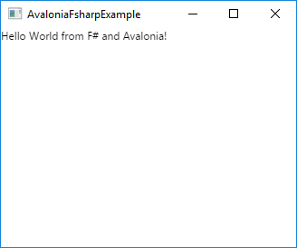

# avalonia-fsharp-example

Code example for the article ["Say hello to Avalonia"](https://gsomix.github.io/blog/01-say-hello-to-avalonia/).



## Build

[.NET Core 2.0 SDK](https://www.microsoft.com/net/download/core#/sdk) is required to build the project.

```
$ dotnet build
```

# Run

```
$ dotnet run
```
